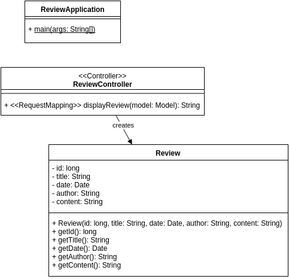
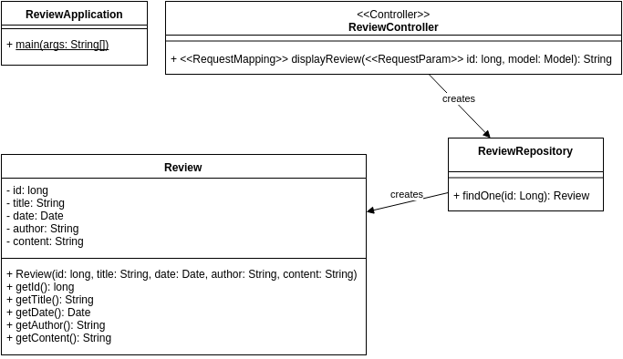
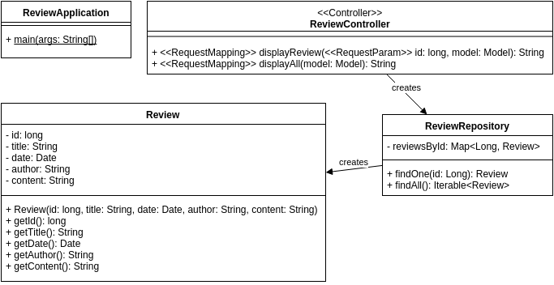
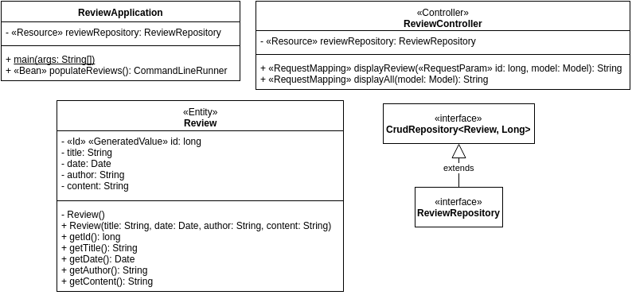

#Developing a Spring Boot MVC Application with JPA: Step-By-Step
Try completing the following objectives on your own for creating a new Spring MVC Application.

## Project Setup (Iteration 0)
- [ ] Create a git repository for your project.
- [ ] add a .gitignore (you can use [this one](.gitignore))

We need to create a `build.gradle` file that uses the Spring Boot plugin and declares the necessary dependencies. These dependencies are:

- Spring Boot [Starters](http://docs.spring.io/spring-boot/docs/1.4.2.RELEASE/reference/htmlsingle/#using-boot-starter), the names of which start with `spring-boot-starter-`:
    - `thymeleaf`: Thymeleaf view support for MVC applications, which transitively includes the other dependencies needed for MVC as well
    - `data-jpa`: Spring Data JPA with Hibernate support.
    - `test`: Spring-specific test support as well as junit, hamcrest, and mockito.
- `org.springframework.boot:spring-boot-devtools`: Development support, allowing things like reloading a Spring Boot application when files change.
- `com.h2database:h2`: H2 database support, enabling a default embedded test database.

- [ ] Add a `build.gradle` file. Either:
    - Use [this one](BuildingWithSpringMvc/build.gradle).
        - [ ] Copy it into your repository folder.
        - [ ] Run `gradle wrapper` (the gradle wrapper task) from your local repository folder.
        - Create folders named:
            - [ ] src/main/java
            - [ ] src/test/java
            - [ ] src/main/resources
    - Use [Spring Initializr](http://start.spring.io/) to generate bootstrap code. This will generate a zip file containing `build.gradle`, source/resource folders, and the gradle wrapper.
        - [ ] Choose to generate a Gradle Project
        - [ ] Specify a Group (ID) of your choice -- your github user id is suggested.
        - [ ] Specify your repository name as the Artifact (ID).
        - Add the following starters:
            - [ ] Thymeleaf
            - [ ] JPA
            - [ ] DevTools
            - [ ] H2
        - [ ] Generate Project
        - [ ] Extract the zip file's contents into your repository folder. Make sure `build.gradle` is in the root.
- [ ] Run `./gradlew eclipse` (use the gradle wrapper to run the eclipse task) from your local repository folder.
- [ ] Import the generated project into Eclipse.

## Review Application
In the following steps, place the classes you create in the `review` package. Refer to [Serving Web Content with Spring MVC](https://spring.io/guides/gs/serving-web-content) for an overview. The steps do not specifically refer to tests, but create appropriate tests (first!) as you progress.

Since this will be a Spring boot application:
- [ ] create an appropriate `review.ReviewApplication` class that calls `SpringApplication.run`.
- [ ] verify that you can run `ReviewApplication`, either as a Java Application in Eclipse or via `./gradlew bootRun`.

###  Display a Single Review
- create a `Review` class with the following attributes:
    - [ ] long id
    - [ ] String title
    - [ ] Date date
    - [ ] String author
    - [ ] String content
- implement a controller and view that will display the Review instance when the url *http://localhost:8080/review* is accessed    
    - [ ] Create a `ReviewController` class that responds to */review* requests. It should:
        - [ ] Create an instance of Review. (Create an appropriate constructor and use the `new` operator.)
        - [ ] Add the review to the `Model` as an attribute.
        - [ ] Return the name of the template for displaying a single review ("review-view").
    - [ ] Create a Thymeleaf template at `src/main/resources/templates/review-view.html` that displays the attributes of the review.

Your classes should look something like this:



### Retrieve the Review from an Entity Repository
- [ ] create a `ReviewRepository` class with a `public Review findOne(Long id)` method that creates and returns a `Review` instance
- modify your `ReviewController` to:
    - [ ] accept an *id* request parameter
    - [ ] call the `findOne` method you created in `ReviewRepository` using the id specified in the request (the specific value of the id does not matter yet)
    


### Display Multiple Reviews
#### Update `ReviewRepository` to support multiple reviews
- [ ] Create an instance attribute in `ReviewRepository` of type `Map<Long, Review>`.
- [ ] Populate this map with three reviews, using each review's id as the key.
- [ ] Create a `public Iterable<Review> findAll()` method in `ReviewRepository` that returns all the reviews from the map.

#### Update the Repository to Display a Specific Review
- [ ] Modify the `findOne` method in `ReviewRepository` to return the review associated with the `id` parameter.

#### Update Controller and Create View in Order to Display All Reviews
- [ ] Add a method to `ReviewController` and an `all-reviews-view.html` template to display all reviews when the url *http://localhost:8080/allReviews* is accessed



### Read reviews from JPA
Currently we are reading reviews from a map we have hardcoded. We want instead to populate our embedded database with data after our Spring Boot application launches.

We will be using Spring Data's JPA support, which dynamically generates repository implementations, so:
- Make the following changes to `ReviewRepository`:
    - [ ] Remove its body (method implementations, etc).
    - [ ] Change it from a `class` to an `interface`.
    - [ ] Have it extend `org.springframework.data.repository.CrudRepository<Review, Long>`. (`Long` is `Review`'s id type.)
- [ ] Update `ReviewController` to inject `ReviewRepository` by using the `@Resource` annotation rather than calling its constructor.

We need to populate our embedded database on application startup, so in your `ReviewApplication` class:
- [ ] Inject a `ReviewRepository` instance by using the `@Resource` annotation.
- [ ] Create an inner class that implements `org.springframework.boot.CommandLineRunner`. This inner class should be a `private class` declared inside the `ReviewApplication` class.
    - [ ] This class's `run(String... args)` method such that it creates Review instances and calls the repository's `save` method to write each of them to the database.
- [ ] Create a @Bean method in `ReviewApplication` that creates (via `new`) and returns an instance of the `CommandLineRunner` you created.

After these changes, your `ReviewApplication` class should look similar to the following:
```java
@SpringBootApplication
public class ReviewApplication {

    public static void main(String[] args) {
        SpringApplication.run(ReviewApplication.class, args);
    }

    @Resource
    private ReviewRepository reviewRepository;

    @Bean
    public CommandLineRunner populateReviews() {
        return new ReviewPopulator();
    }

    private class ReviewPopulator implements CommandLineRunner {
        @Override
        public void run(String... args) throws Exception {
            // code to populate reviews
        }
    }
}
```
    
We need to indicate to JPA that reviews are entities, so make the requisite changes to the `Review` class. (Refer to [Accessing Data with JPA](https://spring.io/guides/gs/accessing-data-jpa) for an example)
- [ ] Annotate the class with @Entity.
- [ ] Annotate its `id` attribute with `@Id` and `@GeneratedValue`.
- [ ] Remove `id` from the constructor since JPA will generate these. Tip: if you use Eclipse's *Change Method Signature* refactoring to remove the `id` parameter, it will update code that calls the constructor, removing the id automagically.
- [ ] Create a default constructor. This should be private since it will only be used by JPA.

At this point, you should be able to run the application and view a listing of reviews in your browser.



### Development Tips

#### DevTools properties

Spring Boot looks in your OS home directory (`C:\Users\*yourUserName*` on Windows or `~` on Linux and Mac) for a file called `.spring-boot-devtools.properties`. This is where you can set and/or override properties for development purposes. In order to log the SQL that JPA/Hibernate is generating, create this file and populate it thusly:
```properties
spring.jpa.show-sql=true
```
#### Accessing the H2 Test Databasse

We are using the temporary embedded H2 database that Spring creates for us. In order to use the H2 console to access this database (after the application is running), access http://localhost:8080/h2-console from your browser. The connection properties should be as follows (you'll probably only need to change the JDBC URL):

property | value
-------- | -----
Driver Class | org.h2.Driver
JDBC URL | jdbc:h2:mem:testdb
User Name | sa
Password | *leave blank*

### Categorize Reviews
During this step, we will be adding a new entity, `Category`. Each review should have a category. To this end:
- [ ] create a `Category` class
- [ ] configure this class as an entity, like we did for `Review`
- [ ] in addition to its id, give it a name attribute

Each `Review` can be in one category, but each `Category` can have many reviews. This is known as a many-to-one relationship from the perspective of `Review`, or a one-to-many relationship from the perspective of `Category`. In order to establish this relationship so that JPA can manage it:
- [ ] add a `Category category` attribute to `Review`
- [ ] modify `Review`'s constructor to allow one to specify either a `Category` instance, which is used to populate the `category` attribute
- [ ] annotate the `category` attribute with `@ManyToOne`

### Create `CategoryRepository`
- [ ] As we did for `Review`, create a `CategoryRepository` interface that extends `CrudRepository`.

### Update `ReviewApplication`
- [ ] Inject a `CategoryRepository` via `@Resource`.
- [ ] Modify the code that creates reviews so that it creates and saves (via the `CategoryRepository`'s `save` method) each category you will use before creating and saving reviews.

### Display Review Categories
- [ ] modify the individual review view so that the category name is displayed
- modify the all reviews view
    - [ ] to display category name
    - [ ] so that reviews are sorted by category (**Extension**)

### References
- Spring MVC Tutorial: [Serving Web Content with Spring MVC](https://spring.io/guides/gs/serving-web-content)
- Spring JPA Tutorial: [Accessing Data with JPA](https://spring.io/guides/gs/accessing-data-jpa)
